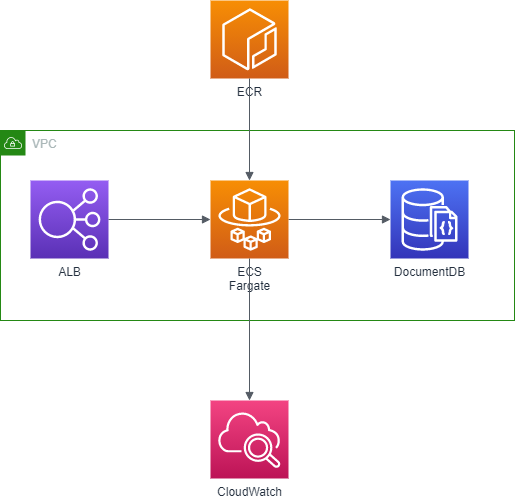
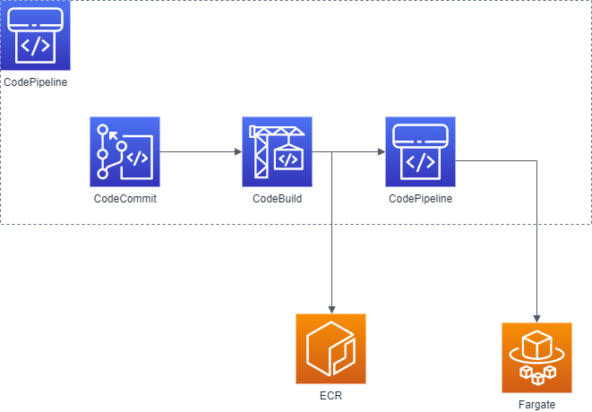

# Phoenix Application Problem
This problem is about to create a production ready infrastructure for the Phoenix Application.

## Problem

The development team has released the phoenix application code.
Your task, if you want to accept it, is to create the production infrastructure
for the Phoenix application. You must pay attention to some unwanted features
that were introduced during development. In particular:

- `GET /crash` kill the application process
- `GET /generatecert` is not optimized and creates resource consumption peaks

## General Requirements

- You may use whatever programming language/platform you prefer. Use something that you know well.
- You must release your work with an OSI-approved open source license of your choice.
- You must deliver the sources, with a README that explains how to run it.
- Add the code to your own Github account and send us the link.

## Application Requirements

- Runs on Node.js 8.11.1 LTS
- MongoDB as Database
- Environment variables:
    - PORT - Application HTTP Exposed Port
    - DB_CONNECTION_STRING - Database connection string `mongodb://[username:password@]host1[:port1][,host2[:port2],...[,hostN[:portN]]][/[database][?options]]`

## Run Application
- Install dependencies `npm install`
- Run `npm start`
- Connect to `http://<hostname|IP>:<ENV.PORT>`

## Problem Requirements

1. Automate the creation of the infrastructure and the setup of the application.
2. Recover from crashes. Implement a method autorestart the service on crash
3. Backup the logs and database with rotation of 7 days
4. Notify any CPU peak
5. Implements a CI/CD pipeline for the code
6. Scale when the number of request are greater than 10 req /sec


# Solution

## Architecture
Fargate will orchestrate ECS instances together via ECR, with an ALB for load balancing.
MongoDB will be run in a managed environment via AWS DocumentDB
Logs will be consumed by AWS Cloudwatch




The solution will leverage the use of CodePipeline and its whole stack, to manage code, deploy, build and test.



## Requirements

| Requirement                                                                  | Solution                                   | 
|------------------------------------------------------------------------------|--------------------------------------------|
| Automate the creation of the infrastructure and the setup of the application.| CloudFormation stack                       | 
| Recover from crashes. Implement a method autorestart the service on crash    | ECS HealthCheck                            | 
| Backup the logs and database with rotation of 7 days                         | CloudWatch log retention                   | 
| Notify any CPU peak                                                          | CloudWatch metrics + alarm                 | 
| Implements a CI/CD pipeline for the code                                     | CodePipeline suite                         | 
| Scale when the number of request are greater than 10 req /sec                | ECS target tracking scaling + ALB ALBRequestCountPerTarget metric | 
| Unwanted features                                                            | ALB path base routing listener rules                      |

## Environment set-up

All following commands can be scripted or managed with a cloudformation template avoiding manual copy and paste (Do not reinvent the wheel)

### VPC

```shell script
aws cloudformation deploy --stack-name network --template-file cloudformation/vpc.yaml --parameter-overrides `
Name=$env:APPLICATION_NAME `
--capabilities CAPABILITY_NAMED_IAM 
```

### ALB

where PUBLIC_SUBNETS and VPC can be retrieved from CloudFormation network stack
We have IAM resources with custom names therefore --capabilities CAPABILITY_NAMED_IAM  is needed

```shell script
aws cloudformation deploy --stack-name alb --template-file cloudformation/load-balancer.yaml --parameter-overrides `
LaunchType=Fargate `
Subnets=$env:PUBLIC_SUBNETS `
VpcId=$env:VPC `
--capabilities CAPABILITY_NAMED_IAM 
```

### Database

where VPC and PRIVATE_SUBNETS can be retrieved from CloudFormation network stack. 
For simplicity default value for username will be used, for production enforce security on secrets
We have IAM resources with custom names therefore --capabilities CAPABILITY_NAMED_IAM  is needed

```shell script
aws cloudformation deploy --stack-name documentDB --template-file cloudformation/database.yaml --parameter-overrides `
VpcId=$env:VPC `
MasterPassword=$env:DB_PASSWORD `
Subnets=$env:PRIVATE_SUBNETS `
--capabilities CAPABILITY_NAMED_IAM 
```

### ECS

where PUBLIC_SUBNETS and VPC can be retrieved from CloudFormation network stack
where SECURITY_GROUP can be retrieved from CloudFormation alb stack
We have IAM resources with custom names therefore --capabilities CAPABILITY_NAMED_IAM  is needed

```shell script
aws cloudformation deploy --stack-name ecs-cluster --template-file cloudformation/ecs-cluster.yaml --parameter-overrides `
LaunchType=Fargate `
SourceSecurityGroup=$env:SECURITY_GROUP `
Subnets=$env:PUBLIC_SUBNETS `
VpcId=$env:VPC `
--capabilities CAPABILITY_NAMED_IAM 
```

Manually create first image

```shell script
$(aws ecr get-login --region $env:REGION --no-include-email)
docker build -t $env:REPOSITORY_URI:latest .
docker push $REPOSITORY_URI:latest
```

where PUBLIC_SUBNETS can be retrieved from CloudFormation network stack
where SECURITY_GROUP, TARGET_GROUP, ALB_FULLNAME and TARGET_GROUP_FULLNAME can be retrieved from CloudFormation alb stack
where ECS_CLUSTER can be retrieved from CloudFormation ecs-cluster stack
where DB_USER, DB_PASSWORD, DB_ENDPOINT can be retrieved from CloudFormation database stack
We have IAM resources with custom names therefore --capabilities CAPABILITY_NAMED_IAM  is needed

```shell script
aws cloudformation deploy --stack-name ecs-service --template-file cloudformation/service.yaml --parameter-overrides `
Cluster=$env:ECS_CLUSTER `
LaunchType=Fargate `
TargetGroup=$env:TARGET_GROUP `
SourceSecurityGroup=$env:SECURITY_GROUP `
Subnets=$env:PUBLIC_SUBNETS `
EcrRepository=$env:ECR_REPOSITORY `
DBUser=$env:DB_USER `
DBPassword=$env:DB_PASSWORD `
DBEndpoint=$env:DB_ENDPOINT `
ALBFullname=$env:ALB_FULLNAME `
TargetGroupFullname=$env:TARGET_GROUP_FULLNAME `
--capabilities CAPABILITY_NAMED_IAM 
```

### CodePipeline

where ECS_CLUSTER and ECR_REPOSITORY can be retrieved from CloudFormation ecs-cluster stack
where ECS_SERVICE can be retrieved from CloudFormation ecs-service stack
We have IAM resources with custom names therefore --capabilities CAPABILITY_NAMED_IAM  is needed

```shell script
aws cloudformation deploy --stack-name deployment-pipeline --template-file cloudformation/deployment-pipeline.yaml --parameter-overrides `
Cluster=$env:ECS_CLUSTER `
Service=$env:ECS_SERVICE `
Repo=$env:REPO `
Branch=$env:BRANCH `
EcrRepository=$env:ECR_REPOSITORY `
--capabilities CAPABILITY_NAMED_IAM 
```
